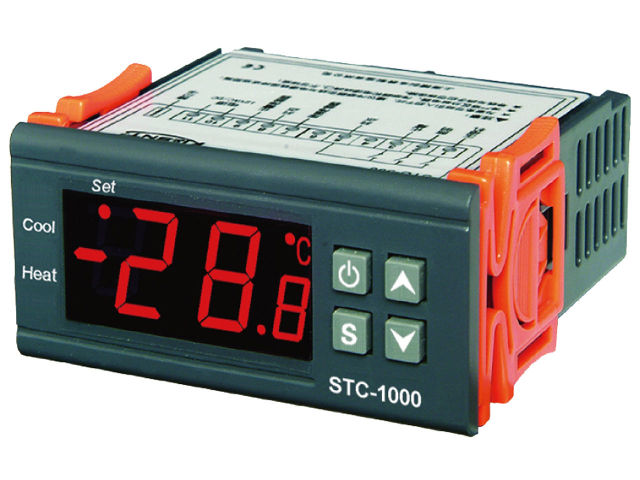
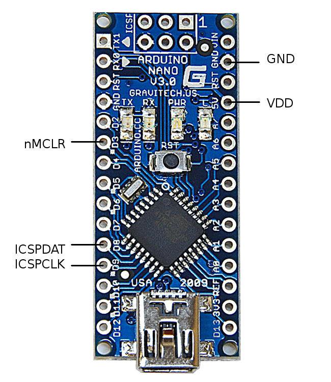
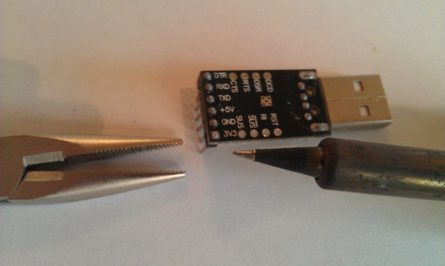
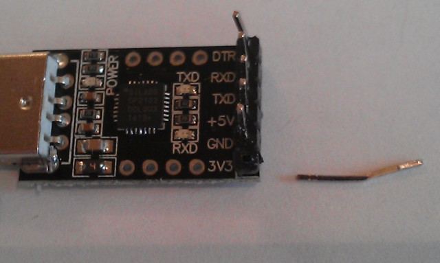
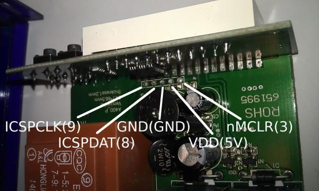

STC\-1000+
==========

STC\-1000+ is an open source implementation of firmware(s) for the STC\-1000 dual stage thermostat that add improvements and features over the version it is shipped with. It also provides an easy and cheap way of uploading said firmware(s) to the thermostat by emulating a programmer using the widely available Arduino platform. Finally the project adds a few tools that make it easier use and upload the firmware(s).
 

The main purpose of this project is provide firmwares that add features that are desirable for brewing beer, but the usage is not limited to this.

Questions?
----------
Please don't open github issues for general questions. Ask freely [in the Homebrewtalk STC\-1000+ thread](http://www.homebrewtalk.com/showthread.php?t=464348). Only open an issue if you discovered an actual bug or have a (realistic) feature request (or better yet, send a pull request).

Quick start
-----------

You'd need an Arduino board (like the Arduino UNO) and an STC\-1000 thermostat with the proper hardware version (A400_P). The correct STC\-1000 can be bought [here](http://www.aliexpress.com/store/product/temperature-controller-STC-1000/1305777_2004466302.html).
Go to the [profile editor and sketch generator](http://goo.gl/z1KEoi), select the firmware version you want (more on the different version below), optionally make the changes you want to the settings and press 'Download sketch'.
Open the sketch with the Arduino IDE and upload it to the Arduino board. Connect the Arduino to the STC\-1000 (how to do that is described later on). Open the serial monitor in the Arduino IDE and follow the instructions.

Introduction
------------

The STC\-1000 is a dual stage (that is, it can control heating *and* cooling) thermostat that is pretty affordable. It is microcontroller operated, that means there is a sort of 'computer on a chip' that reads the temperature of the probe, turns the relays on and off, reads the state of the buttons and updates the display. To do all this, the microcontroller needs to be programmed to perform these tasks. The program is stored in non volatile (flash) memory that is retained when there is no power. The microcontroller can be reprogrammed (flashed) with a new program (firmware), that can other or additional tasks. To do that, a new firmware is needed and you need a programmer that can send it to the microcontroller the way it expects it. The STC\-1000+ project provides both these things (and a few additional things as well).

So far so good, *but* there is a catch. Probably due to the popularity of the STC\-1000, there are a number of clones out there. These are functionally (from a user perspective) equivalent, but are not based in the same design. Specifically, they use other microcontrollers that while having similar specifications, use completely different architectures and most of all, do not have freely available tools (compilers) or even freely available documentation. This makes it extremely hard and/or expensive to change the firmware on these. Just buying an STC\-1000 off the usual auction sites, makes it a complete gamble what hardware version (or which clone) you will receive, you've got the odds stacked against you as the clones probably are using slightly cheaper (and probably worse) components. 

STC\-1000+ is *only* compatible with the A400_P version of the STC\-1000 as this sports the Microchip PIC16F1828 microcontroller, for which there are open tools and freely available documentation. This version is manufactured (and also sold) by [HongKong U-control electric CO Ltd](http://www.sz-youkong.com/). STC\-1000's can be purchased directly from them through their [webshop on Aliexpress](http://www.aliexpress.com/store/1305777).  [Click here to go directly to the STC\-1000's in their Aliexpress store](http://www.aliexpress.com/store/product/temperature-controller-STC-1000/1305777_2004466302.html)

Many thanks to Will Conrad for tracking down the manufacturer and for sharing the information!

To upload (flash) the microcontroller, you also need a programmer. There are official Microchip PIC programmers (Pickit) to purchase, but they typically cost $60-$70. There are also clones available on the usual auction sites that cost around $22. Neither of these options are very cost effective, considering the price of the STC\-1000. So, as a part of the STC\-1000+ project, a PIC programmer is implemented as an Arduino sketch, where the Arduino instead will act as a PIC programmer. This makes it a lot more cost effective, as an Arduino Nano clone cost around $2.30 last I checked.

The firmwares
-------------

There are a few variations of firmwares to choose from. They can be generated with custom EEPROM data from the [profile editor and sketch generator](http://goo.gl/z1KEoi) or simply choose the correct *picprog.ino* to download.
For older releases see the [releases page](https://github.com/matsstaff/stc1000p/releases).

### STC\-1000+ firmware

This firmware, in addition to act as a thermostat, has the possibility to update the setpoint (the desired temperature to keep) according to a schedule (a profile) once per hour. The main purpose of this firmware is control the temperature of fermenting beer.
For more information on the specifics of this firmware, please see [the user manual](/usermanual/README.md).
The firmware comes in a few variations, depending on what the 'free' pin on the MCU is used for.

* **Vanilla** Plain version, with no extra features.
* **Dual Probe** Use a second temperature probe to put limits on ambient temperature.
* **Fine Offset 433MHz** Send temperature data wireless (emulate wireless thermometer).
* **Communication** Use an arduino to send/receive data to/from the STC.

### STC\-1000+ firmware with minute timebase

The exact same thing as the normal STC\-1000+ firmware, except profile is updated every minute instead of every hour. Same variations of extra featured versions.

### STC\-1000+ OVBSC (one vessel brew system controller) firmware

Firmware built to control a single vessel brew system (for example Braumeister, Grainfather and similar systems/DIY setups). Read more [here](/ovbsc/README.md)

# Flashing the firmware

## Prerequisites

You will need:

* An STC-1000 (with the correct hardware revision, A400_P)

* An Arduino compatible development board (Arduino UNO or Nano or Arduino Pro Mini 5V 16Mhz) and the needed parts to connect it to a computer (USB cable or an USB/serial adapter for the Pro Mini)

* A computer with Arduino IDE installed (download from here: [http://arduino.cc/en/main/software](http://arduino.cc/en/main/software))

* A female pin header and dupont wires (and soldering equipment if not using an Arduino UNO)

 
*Female pin header (1x5, 0.1inch/2.54mm pitch)*

 
*Dupont wires (male)*

## Building a programmer

### Arduino UNO

An arduino UNO is the simplest way to build a programmer, as it can be done without any soldering. It is a bit more expensive though, but there are clones that are pretty cheap (arounf $3.60). All you need as the board, a few dupont wires and a female pin header. You may need an USB cable as well.

 
*A completed Arduino UNO programmer setup. Note that the pinheader is 6 pin, that is what I had around, only 5 pins are used though.*

### Arduino Nano

The Arduino Nano might just be the most cost effective and simple way to go. You'd need to do some light soldering.

 
*Arduino Nano wiring schematic*

### Arduino Pro Mini + CP2102 (or CH340 or FT232 or any other similar USB to TTL serial adapter)

The Arduino Pro Mini + TTL USB addon is what I've been using. I like the complactness of the finished build, but I'd really recommend going with the Nano or UNO, as it is easier (and probably cheaper).
You'd need to do a bit more soldering. Currently, this will cost around $5 on eBay. Search for "arduino pro mini 5V 16M CP2102" or "arduino pro mini 5V 16M ch340g" and you should find suitable matches. If you are running Windows (but why would you?), then you may need to download drivers for the CP2102 or CH340G, you can find them [at Silicon Labs for CP2102](http://www.silabs.com/products/mcu/pages/usbtouartbridgevcpdrivers.aspx) or [here for the CH340](http://www.wch.cn/downloads.php?name=pro&proid=65). You will also need some wire. I find it easiest to use a 5 pin dupont cable. I will show how I build the programmer.

 
*The material I use, Arduino pro mini, CP2102, 5 pin dupont cable and heat shrink tubing (optional).*

First I use a flat nose plier to bend the 90 degree pin header on the CP2102 back straight.

 
*CP2102 with straightened pinheader.*

The 3.3V pin needs to go. You could probably just cut it, but I heat up the solder with the soldering iron while at the same time pulling it from the other end with some pliers.

 
*Before desoldering the 3.3V pin.*

 
*After desoldering.*

Flip the pro mini upside down and the pins should line up (note: rx goes to tx and tx to rx, the others should match)

 
*Pro mini lined up on the pin header, note the empty spot for the 3.3V pin.*

Solder it in and cut the excess of the pins.

 
*CP2102 and pro mini joined together.*

Then just cut off one end of the dupont cable. Strip just a little bit of insulation off the end of each cable and pre tin. Solder each cable in the correct position (D9, D8, GND, VCC, D3). Best to feed it from below the board, as the reset button (which will still work) and other stuff is on the other side.

 
*This will function as a programmer.*

The last step is optional, but will make it more durable and a bit neater. Cut a few pieces off of a hot glue stick and put around and under the wires. Then feed it through an appropriately cut length of heat shrink tubing (usb connector first). 15mm diameter heat shrink tubing is a snug fit. When heating the tubing, the glue will melt and make a cheapish stress relief for the cables. A hot air gun works well to shrink the tubing, an electric hot plate (stove) also work very well. In pinch, you can even use a lighter.

 
*Hot glue bits placed around and under the wires.*

 
*The finished 'product'.*

## Upload the sketch to the Arduino

The first thing that is needed is to upload the sketch **Before the connections are made from the Arduino to the STC\-1000, the sketch needs to be uploaded to the Arduino.** It is important that connections are not made before this. An unknown program running on the Arduino could set the pins to the wrong state and short circuit the STC-1000. This could damage your STC-1000 and/or your Arduino.

First, the Arduino IDE needs to be installed, if you haven’t already. If you are not familiar with Arduino, you can read more about it at [the arduino webpage](http://arduino.cc/) or [wikipedia](http://en.wikipedia.org/wiki/Arduino).

Open *picprog.ino (or picprog_???.ino depending on firmware version)*, either by double-clicking the file or from *File -> Open* in the Arduino IDE. If it asks to create a folder then accept. Connect the Arduino with the USB cable and make sure the correct serial port is set under *Tools -> Serial port* and the correct board is selected under *Tools -> Board*. Then upload the sketch to the Arduino (*File -> Upload*).

It is recommended that you close the Arduino IDE once the sketch is uploaded and disconnect the programmer from the computer.

Only when the sketch is uploaded correctly is it safe to make the connections to the STC-1000.

## Connect the STC\-1000

**Important:** The STC\-1000 must be completely **unplugged** from mains power, but the sensor cable should be connected. During programming and testing, the STC\-1000 will be powered from the Arduino.

|STC-1000|Arduino|
|--------|-------|
|ICSPCLK |D9     |
|ICSPDAT |D8     |
|GND     |GND    |
|VDD  	 |5V     |
|nMCLR	 |D3     |
*Connections between STC-1000 and Arduino boards*

The connections can be made using pretty much any electrical wire, but a solid core or Dupont style wires make it a lot easier. Pin headers and Dupont wires can be found cheap on eBay and Amazon. 

Start by opening the STC\-1000. Cut or remove the sticker. 

 
*Cut or remove sticker.*

Lift the tabs that hold the front panel in place and slide the board out.

 
*Lift the tabs and pull board out.*

Check the board version (upper left corner in image) and locate the programming header.

 
*Locate programming header connections..*

It might be easier to access from the bottom of the board.

 
*Programming header can be accessed from bottom of the board as well.*

The best way to proceed is to use a vacuum solder sucker and a soldering iron to clean out the solder from the programmer header pads, exposing the holes. You might also be able to clear the holes by heating the pad from underneath with the soldering iron, then rapidly remove the iron once the solder is liquid and quickly blowing out the solder. Just take proper precautions, if trying this method.

Then the programming header can be inserted from the top of the board and soldered in place. This way you will have easy access the pins, making any future upgrades easier.

If you are not able to solder, a temporary connection for programming can be made by simply pressing the pins of the pin header against the pads by hand. The board is coated, so you may need to clean the solder pads to make the connection. 

 
*Programming without soldering (image courtesy of wilconrad)*

## Performing the upload

 
*Example setup (note: sensor is not connected, but it should be).*

When the connections are made, connect the arduino to the computer, open the Arduino IDE and open the serial monitor in the Arduino IDE (*Tools -> Serial Monitor*). Make sure it is set to **115200 baud** and **No line ending**. 

You should be greeted with the following output:

*STC-1000+ firmware sketch.* 
*Copyright 2014 Mats Staffansson* 
*Send 'd' to check for STC-1000*

Enter 'd' (without the apostrophes) in the serial monitor input field and press 'Send' button. You should then receive:

*Enter low voltage programming mode* 
*Leaving programming mode* 
*Device ID is: 0x27C5* 
*STC-1000 detected.* 
*No previous STC-1000+ firmware detected.* 
*Consider initializing EEPROM when flashing.* 
*Sketch has version 1.06* 
*Send 'a' to upload Celsius version and initialize EEPROM data.* 
*Send 'b' to upload Celsius version (program memory only).* 
*Send 'f' to upload Fahrenheit version and initialize EEPROM data.* 
*Send 'g' to upload Fahrenheit version (program memory only).* 

If you see this (well, version number may differ), then you are good to go. If you instead see:

*STC-1000 NOT detected. Check wiring.*

Then check your connections and try again, until you get the correct output.

Send 'a' or 'f' to upload the version you want (Celsius or Fahrenheit). If you are upgrading from a previous version of STC-1000+, you may want to use the 'b' or 'g' command instead. The difference is that all the data will be retained in EEPROM (i.e. profiles, temperature correction et.c.). When upgrading, the sketch will indicate (on the 'd' command output) if there are changes that might invalidate your current EEPROM data, and if so you might want to use the 'a'/'f' command even when upgrading, to make sure the data has sane defaults.

After sending the upload command, a lot of output will appear in the serial monitor (that might be useful, should there be a problem) and due to how the the hardware is designed, it will also make some noise during programming (this takes ~20 seconds).

Updates
-------

|Date|Release|Description|
|----|-------|-----------|
|2014-04-04|v1.00|First release|
|2014-04-11|v1.01|Increase approximative ramping steps to 64|
|2014-04-15|v1.02|Improved temperature averaging|
|2014-04-16|v1.03|Added leaky integration filtering, improved averaging (+ bugfix)|
|2014-05-25|v1.04|A couple of minor improvements and a minor bugfix|
|2014-08-02|v1.05|Reset both heating and cooling delay when either heating or cooling cycle ends. Improved power off| functionality, increased button debounce time, allow longer heating delays.|  
|2014-09-14|v1.06|Add functionality for 2nd temp probe (to limit heating/cooling). Display 'OFF' in soft off mode. Added user definable temperature alarm. Added profile 'editor' webpage.|
|2015-01-02|v1.07|Fixed bug where every other profile had wrong limits. Fixed soft on tempprobe switch bug.|
|2015-09-10|v1.08|Added single wire communication and 433Mhz firmwares.|
|201?-??-??|v1.09|Merge OVBSC and minute branch, improved webpage, some refactoring.|

Some excellent user provided content
------------------------------------
STC-1000+ Menu Navigation by Will Conrad   

STC-1000+ Temp Profile Programming by Will Conrad   

STC-1000+ Flashing Firmware by Will Conrad   

STC-1000+ PRO by Greg Smith 

STC-1000+ Firmware upload by Matt Hall   

