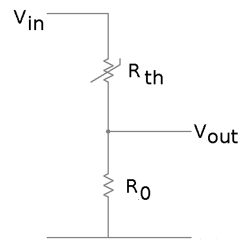

About
=====
This is a small project to make updates to the NTC lookup table a lot easier and robust (primarily for the STC-1000+ project).
It makes use of the 'NTC thermistor library' http://thermistor.sourceforge.net/

Background
==========
In the STC-1000, an NTC thermistor is used to 'read' the temperature. 
The thermistor is connected to the A/D via a voltage divider resistor network like this:

As the temperature changes, the resistance of the thermistor will also change, and thus the voltage seen by the A/D. The A/D converts the voltage to a digital value. The problem at hand is 'mapping' this digital value, (that represents a voltage, that is proportional to the resistance of the thermistor, that correlates to the thermistor temperature) to a temperature that is reasonably accurate in a resonably code and computationally efficient manner.
Thermistors are notoriously non-linear (that is the temperature-resistance curve is *NOT* a straight line). 
So, the scheme is to create a lookup up table (LUT), that maps the digital value to a temperature (as doing this numerically with a mathematical model of the curve would be too complex code/computational wise).

As a side note: creating a look up table for every single possible value would also make for a too large LUT. Though, looking at a small enough part of the temperature/resistance curve, it can be treated a straight line without loosing too much accuracy. The tradeoff is made to create a look up table with enough points, to be able to linearly interpolate between them.

As a second side note: To make this computationally effective (without hardware multiplier), the look up table points needs to be made at places that are power of two (due to binary representation of digits in the MCU). 

Now, it seems that pretty much the best case scenario when shopping for (cheap) thermistors, is that you are provided with a temperature/resistance table. Worst case, you can try to measure it up for yourself.
This table needs to be converted to the look up table that the program can use.
The table is fed into the NTC thermistor library to calculate Steinhart-Hart coefficients, then the resistance is back calculated for the points of interest, the resistance is then converted to a temperature using the Steinhart-Hart coefficients. 

Lastly, a neatly C formatted look up table (or rather two, both Fahrenheit an Celsius) are printed.

Usage
=====
The make file is targeted for GCC. Just run make, and if all is well, an excutable ('lut') will be created.

Run lut with a single argument that is a file containing resistance-temperature values, separated by a single tab.
For example './lut ntc-10k-3435.txt'

It will output a lot of stuff, but the last few lines will be the actual code lines to go into STC-1000+ source (in page0.c).

The current model used for STC-1000+ is the data in ntc-10k-3435.txt.
As far as I know, the sensor shipped with the STC-1000 is a 10k NTC thermistor with a &beta;25&deg;C/85&deg;C value of 3435, presumably 1%.

The program can optionally accept parameters to change the default *R0*, as well as *AD_MAX* and *AD_STEP*.

*AD_MAX*, is the number of values the A/D can produce. The A/D in the PIC16F1828 is 10-bit, and thus this value is 2^10 = 1024.

*AD_STEP* is the number of A/D points for each look-up point. For STC-1000+, 32 steps are used. That gives a total of 1024/32 = 32 look up points.
