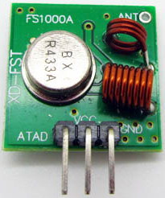

STC-1000+ USER MANUAL
=====================

Mats Staffansson

© 2014-2015

# Changelog

2014-05-25:	Updated the ramping section with the change from 8 to 64 substeps. 
2014-06-30:	Updated heating and cooling delay (reset on either cycle) 
2014-08-12:	Added info on second temp probe and the very cheap programmer 
2014-08-20:	Added info on setpoint alarm and made formatting changes 
2014-08-22:	Added more info on using the second temp probe 
2014-09-04:	Changed setpoint alarm functionality 
2015-04-21:	Added info on cummunication and 433Mhz firmwares 
2015-09-15:	Edited for v1.09 release 

# Features

* Both Fahrenheit and Celsius versions
* Up to 6 profiles with up to 10 setpoints.
* Each setpoint can be held for 1-999 hours (i.e. up to ~41 days).
* [Web browser profile editor](http://goo.gl/z1KEoi) 
* Approximative ramping
* Somewhat intuitive menus for configuring
* Separate delay settings for cooling and heating
* Configurable hysteresis (allowable temp swing) from 0.0 to 2.5°C or 0.0 to 5.0°F
* User definable alarm when temperature is out of or within range
* Different editions of the firmware with special use of RA1 pin:
* - Secondary temp probe (fridge temp) to limit heating and cooling
* - Single wire communication to read/set configuration 
* - Use cheap RF transmitter to send temperature wireless
* Button acceleration, for frustrationless programming by buttons

# Using the STC-1000+ firmware

## Navigation and menus

By default current temperature is displayed in C or F on the display, depending on which firmware is used. Pressing the 'S' button enters the menu. Pressing button 'up' and 'down' scrolls through the menu items. Button 'S' selects and 'power' button steps back or cancels current selection.

The menu is divided in two steps. When first pressing 'S', the following choices are presented:

|Menu item|Description|
|--------|-------|
|Pr0|Set parameters for profile 0|
|Pr1|Set parameters for profile 1|
|Pr2|Set parameters for profile 2|
|Pr3|Set parameters for profile 3|
|Pr4|Set parameters for profile 4|
|Pr5|Set parameters for profile 5|
|Set|Settings menu|
*Table 2: Menu items*

Selecting one of the profiles enters the submenu for that profile.

Pr0-5 submenus have the following items:

|Sub menu item|Description|Values|
|--------|-------|-------|
|SP0|Set setpoint 0|-40.0 to 140͒°C or -40.0 to 250°F|
|dh0|Set duration 0|0 to 999 hours|
|...|Set setpoint/duration x|...|
|dh8|Set duration 8|0 to 999 hours|
|SP9|Set setpoint 9|-40.0 to 140°C or -40.0 to 250°F|
*Table 3: Profile sub-menu items*

You can change all the setpoints and durations associated with that profile from here. When running the programmed profile, *SP0* will be the initial setpoint, it will be held for *dh0* hours (unless ramping is used). After that *SP1* will be used as setpoint for dh1 hours. The profile will stop running when a duration (*dh*) of 0 hours OR last step is reached (consider *dh9* implicitly 0). When the profile has ended, STC-1000+ will automatically switch to thermostat mode with the last reached setpoint. (So I guess you could also consider a *dh* value of 0 as infinite hours).

The settings menu has the following items:

|Sub menu item|Description|Values|
|---|---|---|
|hy|Set hysteresis|0.0 to 5.0°C or 0.0 to 10.0°F|
|hy2|Set hysteresis for second temp probe|0.0 to 25.0°C or 0.0 to 50.0°F|
|tc|Set temperature correction|-5.0 to 5.0°C or -10.0 to 10.0°F|
|tc2|Set temperature correction for second temp probe|-5.0 to 5.0°C or -10.0 to 10.0°F|
|dI|Device ID for Fine Offset 433MHz firmware|0 to 15|
|SA|Setpoint alarm|0 = off, -40 to 40°C or -80 to 80°F|
|SP|Set setpoint|-40 to 140°C or -40 to 250°F|
|St|Set current profile step|0 to 8|
|dh|Set current profile duration|0 to 999 hours|
|cd|Set cooling delay|0 to 60 minutes|
|hd|Set heating delay|0 to 60 minutes|
|rP|Ramping|0 = off, 1 = on|
|Pb2|Enable second temp probe for use in thermostat control|0 = off, 1 = on|
|rn|Set run mode|Pr0 to Pr5 and th|
*Table 4: Settings sub-menu items*

**Hysteresis**, is the allowable temperature range around the setpoint where the thermostat will not change state. For example, if temperature is greater than setpoint + hysteresis AND the time passed since last cooling cycle is greater than cooling delay, then cooling relay will be engaged. Once the temperature reaches setpoint again, cooling relay will be disengaged.

**Hysteresis 2**, is the allowable temperature range around the setpoint for temp probe 2, if it is enabled (Pb=1). For example, if temperature 2 is less than *SP* - *hy2* cooling relay will cut out even if *SP* - *hy* has not been reached for temperature (1). Also, cooling will not be allowed again, until temperature 2 exceeds *SP* - 0.5 \* *hy2* (that is, it has regained at least half the hysteresis).

**Temperature correction**, will be added to the read temperature, this allows the user to calibrate temperature reading. It is best to calibrate around your working point. That means for fermentation, it is better to calibrate at room temperature against a reference thermometer than using ice water.

**Temperature correction 2**, same as tc but for secondary temp probe.

**Device ID**
Only available for the FO433MHz firmware. The Fine Offset protocol allovs for 16 different ID:s. That means more than one STC\-1000+ or Fine Offset tempsensor can be used at the same time, provided they use different ID's.

**Setpoint alarm**, if setpoint alarm is greater than 0.0, then the alarm will sound once temperature differs from *SP* by more than *SA* degrees (this can be useful to warn against malfunctions, such as fridge door not closed or probe not attached to carboy). If *SA* is less than 0.0, then the alarm will sound if the temperature does **NOT** differ by more than (-) *SA* degrees (this could be used as an indication that wort has finally reached pitching temp). If *SA* is set to 0.0, the alarm will be disabled. If the alarm is tripped, then the buzzer will sound and the display will flash between temperature display and showing "SA", it will not however disengage the outputs and the unit will continue to work as normal. Please note, that care needs to be taken when running a profile (especially when not using ramping or with steep ramps) to allow for a sufficiently large margin, or the alarm could be tripped when setpoint changes.

**Setpoint**, well... The desired temperature to keep. The way STC-1000+ firmware works, setpoint is *always* the value the thermostat strives towards, even when running a profile. What the profile does is simply setting the setpoint at given times.

**Current profile step** and **current profile duration**, allows 'jumping' in the profile. Step and duration are updated automatically when running the profile, but can also be set manually at any time. Note that profile step and profile duration are the variables directly used to keep track of progress in a profile. Little or no validation is made of what values are entered. It is up to the user to know what he/she is doing by changing these values. Changing these values will not take effect until next point in profile is calculated, which could be as much as one hour. Every hour, current duration, *dh* (and if next step is reached, also current step, *St*) is updated with new value(s). That means in case of a power outage, STC-1000+ will pick up (to within the hour) from where it left off. Current profile step and current profile duration are only available in the menu when a profile is currently running.

**Cooling** and **heating delay** is the minimum 'off time' for each relay, to spare the compressor and relays from short cycling. If the the temperature is too high or too low, but the delay has not yet been met, the corresponding LED (heating/cooling) will blink, indicating that the controller is waiting to for the delay to pass before it will start heating or cooling. When the controller is powered on, the initial delay (for both heating and cooling) will **always** be approximately 1 minute, regardless of the settings. That is because even if your system could tolerate no heating or cooling delays during normal control (i.e. *cd* and/or *hd* set to zero), it would be undesirable for the relay to rapidly turn on and off in the event of a power outage causing mains power to fluctuate. Both cooling and heating delays are loaded when either cooling/heating relays switched off. So, for instance if you set cooling delay to 60 minutes and setpoint is reached, turning cooling relay off, it will be approximately one hour until cooling relay will be allowed to switch on again, even if you change your mind and change the setting in EEPROM (i.e. it will not affect the current cycle).

The delay can be used to prevent oscillation (hunting). For example, setting an appropriately long heating delay can prevent the heater coming on if the cooling cycle causes an undershoot that would otherwise cause heater to run. What is 'appropriate' depends on your setup.

**Run mode**, selecting *Pr0* to *Pr5* will start the corresponding profile running from step 0, duration 0. Selecting *th* will switch to thermostat mode, the last setpoint from the previously running profile will be retained as the current setpoint when switching from a profile to thermostat mode.

**Thermostat mode**

When mode is set to thermostat, setpoint, *SP*, will not change and the controller will aim to keep the temperature to within the range of *SP* ± *hy*. Much like how the normal STC-1000 firmware works.

The thermostat control runs approximately once every second.

**Running profiles**

By entering the 'rn' submenu under settings and selecting a profile, the current duration, *dh*, and current step, *St*, is reset to zero and the initial setpoint for that profile, *SP0*, is loaded into *SP*. Even when running a profile, *SP* will always be the value the controller aims to keep. The profile simple updates *SP* during its course. When a profile is running the 'Set' LED on the display will be lit as an indication.

From the instant the profile is started a timer will be running, and every time that timer indicates that one hour has passed, current duration, *dh*, will be incremented. If and only if, it has reached the current step duration, *dhx*, current duration will be reset to zero and the current step, *St*, will be incremented and the next setpoint in the profile will be loaded into *SP*.  Note that all this only happens on one hour marks after the profile is started.

So, what will happen if the profile data is updated while the profile is running? Well, if that point has not been reached the data will be used. For example profile is running step 3 (with the first step being step 0). Then *SP3* has already been loaded into *SP*, so changing *SP0* - *SP3* will not have any effect on the current run. However, the duration *dh3* is still being evaluated every hour against the current duration, so changing it will have effect. 

Changing the current duration, *dh*, and current step, *St*, will also have effect, but the change will not be immediate, only on the next one hour mark will these new values be used in the calculation. You will need to know what you are doing when changing these values manually, but correctly used, it could come in handy.

Changing the setpoint, *SP*, when running a profile, will have immediate effect (as it is used by thermostat control), but it will be overwritten by profile when it reaches a new step.

Once the profile reaches the final setpoint, *SP9*, or a duration of zero hours, it will switch over to thermostat mode and maintain the last known setpoint indefinitely.

Finally, to stop a running profile, simply switch to thermostat mode.

## Ramping

The essence of ramping is to interpolate between the setpoints in a profile. This allows temperature changes to occur gradually instead of in steps.

Unfortunately, due to hardware limitations, true ramping (or true interpolation), is not feasible. So instead, an approximative approach is used.

Each step is divided into (at most) 64 substeps and on each substep, setpoint is updated by linear interpolation. The substeps only occur on one hour marks, so if the duration of the step is less than 64 hours, not all substeps will be used, if the duration is greater than 64 hours, setpoint will not be updated on every one hour mark, for example if duration is 192 hours (that is 8 days), setpoint will be updated every third hour).

Note, that in order to keep a constant temperature with ramping enabled, an extra setpoint with the same value will be needed (STC-1000+ will attempt to ramp between all setpoints, but if the setpoints are the same, then the setpoint will remain constant during the step).

You can think of the ramping as being true, even if this approximation is being used, the only caveat is, if you need a long ramp (over several days or weeks) and require it to be smoother. Then you may need to split it over several steps.

Another tip would be to try to design your profiles with ramping in mind, if possible (that is include the extra setpoints when keeping constant temperature is desired), even if you will not use ramping. That way, the profiles will work as expected even if ramping is enabled.

## Secondary temperature probe input

The STC-1000 (A400_P) hardware seems to have been designed to allow for two temperature probes to be connected, but the stock firmware only uses one and it alo only ships with one sensor. Also the screw type terminal for the second sensor is not populated as well as the voltage divider resistor and the noise reduction capacitor.

 
*Fig 18: The temperature probe connections (note: the transformer is removed, for a better view)*

In *Fig 18*, you can see that there is room on the PCB for a three pole screw terminal and that R3 and and C3 is unpopulated. I find that the best way is to desolder the two pole screw terminal, solder in the missing resistor and solder back a three pole screw terminal. To solder in the missing SMD resistor is fiddly work though, you'll need a fine tip soldering iron and good eyes. The capacitor can be left out, as its only purpose is to reduce noise (and the STC-1000+ firmware does filtering). It will also interfere with flashing new firmware (the rise time of ICSPCLK becomes unacceptably slow and firmware upload fails). 

There is an easier route however, all the connections required can also be found on the programming header. Connect the resistor between ground (gnd) and ICSPCLK, and the thermistor between Vcc and ICSPCLK.

The resistor must be 10kOhm and have as good accuracy as possible (1%). If you go for the SMD route, you'll need a 0603 formfactor resistor. If you need an additional probe, what you are looking for is a 10k NTC probe with a beta value of 3435 (I'm guessing that is between 25-85C, but the retailers rarely specify). 

## Using secondary temperature probe input

The idea is to use the secondary temperature probe to measure the fridge air temperature or the temperature of a smaller thermal mass (water or sand) in the fridge. This should respond faster to the temperature fluctuations than the beer. By carefully limiting how far this temperature is allowed to deviate from the setpoint, it should be possible to limit the over/under-shoot that can occur as the heater/cooler continues to operate until the beer has reached the setpoint. Ther correct value for *hy2* will be dependent of the specific setup (and also the *hy* value) and will need to be set by trial and error or by analyzing how much over/under-shoot is seen and how far off setpoint the fridge temperature will go. This is a double edged sword, you do not want to set too tight hysteresis for the second temp probe as it will put more stress on the compressor and may make it harder to reach setpoint. But you also want to constrain it enough to be effective. Err on the safe side to begin with (using a larger *hy2* setting) and constrain it more as needed.

It should also be noted, that it would be a very good idea to make sure the two temperature probes are calibrated (at least in respect to each other) around the setpoint.

To enable use of the second temp probe in the thermostat logic (i.e. to enable *hy2* limits on temperature2), set *Pb2* = 1. Even with with it disabled it is still possible to switch to display the second temperature input using a short press on the power button. 

## Single wire communication

It is possible to read temperature, cooling/heating relay status, and also both read and write from/to the EEPROM of the STC, using a simple half-duplex single wire communication protocol.
This comes at the expense of secondary probe usage however, as both the physical pin as well as the code space is repurposed. 
In order for this communication to work, a pulldown resistor is needed on the *ICSPCLK* line. 10k works out nicely, and this is the exact same resistor that will be needed for the second probe to work. Additionally, as the protocol is bidirectional it is a very good idea to add a ~1k resistor in series with the *ICSPCLK* line to protect both the STC and the communication master (Arduino) from harmful currents if both should happen to drive the line in the event of a protocol failure. 
A second sketch is added to be able to upload this version of the firmware to the STC, called *picprog_com.ino*. Upload it  and flash the STC as normal.

## Example communication master sketch 
An example sketch implementing a communication master and also has a simple command line parser is also provided, *com.ino*. This sketch has all the communication master details implemented to 'talk' to the STC, and can be adapted to suit specific requirements (datalogging, wireless et.c.).  
The sketch uses the same pinout as the programming sketch, so the exact same hardware can be used for communication as for flashing the STC, with the notable exeption of the resistor(s) needed. Adding these resistors will not affect the use of the hardware for flashing, so adding the resistor(s) can safely be done to an existing programmer. 

The example sketch also has a command parser for interacting with the STC using the arduino serial interface (i.e. the Arduino IDE Serial Monitor). The sketch parses lines and the serial monitor needs to be set to 115200bps and have a line ending selected (newline or carriage return).

|Command|parameter1|parameter2|Description|
|-------|----------|----------|-----------|
|t|||Read current temperature|
|c|||Read state of cooling relay|
|h|||Read state of heating relay|
|r|address||Read EEPROM configuration address|
|w|address|data|Write configuration data to EEPROM address|

The sketch accepts two addressing modes for the *r* and *w* commands. Literal and mnemonic. Literal addresing means simpy the numeric value of the EEPROM address (0-127). When using literal addressing, the data returned or stored also will be literal (i.e. integer value). 
For example: The command *r 0* will read EEPROM address 0 and return the literal value. At address 0 the first setpoint of the first profile is stored, and it might return something like *EEPROM[0]=650*. As this is a setpoint, it is a temperature, and it is stored as a multiple of 10, so the actual temperature would be *65.0*. 
Also, writing with literal addressing expects literal values. So to change the setpoint to *67.0*, the command *w 0 670* could be issued. The sketch will (hopefully) reply *Ok*.

While using literal addressing can be useful, it it not very user friendly, so to make the sketch just a bit useful, mnemonic addressing is also possible. Reading the first setpoint of the first profile could also be done by issuing *r SP00*. The sketch replies *SP00=67.0*, note that the sketch now prints the temperature 'as expected' as well. The same goes for writing configuration using mnemonic addressing *w SP00 65.0*. 

The following table shows the mnemonic adresses:

|Address|Mnemonic|Description|
|-------|--------|-----------|
|0-113|SP*xy*   dh*xy*|Setpoint and duration of profile *x* step *y*|
|114|hy|Hysteresis|
|115|hy2|Hysteresis probe 2|
|116|tc|Temperature correction|
|117|tc2|Temperature correction probe 2|
|118|SA|Setpoint alarm|
|119|SP|Setpoint|
|120|St|Current step of running profile|
|121|dh|Current duration of running profile|
|122|cd|Cooling delay|
|123|hd|Heating delay|
|124|rP|Ramping|
|125|Pb2|Probe 2 regulation|
|126|rn|Run mode, (Pr*x*, th)|

As you can see, this corresponds closely to the menu system on the STC-1000\+, so it should be intuitive if you are already familiar with it. 
Note1: The command parser is case sensitive. 
Note2: There is very little error checking on the supplied values, so use care. 

## 433MHz wireless sensor (Fine Offset)
This firmware provides an easy and cheap way of transmitting the temperature from the STC-1000 to an existing home automation solution. Simply hook up a cheap RF transmitter module to the programming header on the STC (power, ground and the data line to *ICSPCLK*). Every 48 seconds the STC will then transmit the temperature (and also the state of the relays in the humidity field) using the Fine Offset protocol.

 
*Fig 19: 433MHz RF transmitter*

This has been verified to work with a [Tellstick Duo](http://www.telldus.se/products/tellstick_duo), but it would probably work with RFXtrx as well.

## Additional features

**Sensor alarm**, if the measured temperature is out of range (indicating the sensor is not connected properly or broken), the internal buzzer will sound and display will show 'AL'. If secondary probe is enabled for thermostat control (*Pb2* = 1), then alarm will go off if that temperature goes out of range as well. On alarm, both relays will be disengaged and the heating and cooling delay will be reset to 1 minute. So, once the temperature in in range again (i.e. sensor is reconnected), temperature readings can stabilize before thermostat control takes over.

**Power off**, pressing and holding power button for a few seconds when the controller is not in menu (showing current temperature), will disable the relays (soft power off) and show 'OFF' on the display. To really power off, you need to cut mains power to the device. The soft power off state will remain after a power cycle. Long pressing the power off button again will bring it out of soft power off mode.

**Switch temperature display**, pressing and releasing the power button quickly will switch which temperature probe's value is being shown on the display. If temperature from the secondary probe is showing an additional LED (between the first two digits) will be lit as an indication.

By pressing and holding 'up' button when temperature is showing, current setpoint will be displayed. 

By pressing and holding 'down' button when temperature is showing, *th* will be displayed if the controller is in thermostat mode. If a profile is running, it will cycle through *Prx* (where *x* is the profile number), current profile step and current profile duration, to indicate which profile is running and the progress made.

By pressing and holding 'up' and 'down' button simultaneously when temperature is showing, the firmware version number will be displayed.

# Development

STC-1000+ is written in C and compiled using [SDCC 3.3.0](http://sdcc.sourceforge.net) and [GPUTILS 1.2.0](http://gputils.sourceforge.net).

Building the HEX files are done by invoking

make all clean

## Useful tips for development

* You will need the [PIC16F1828](http://ww1.microchip.com/downloads/en/DeviceDoc/41419D.pdf) datasheet

* And to read the [SDCC Compiler user guide](http://sdcc.sourceforge.net/doc/sdccman.pdf), especially the section regarding the PIC14 port

* Initialization of static local variables does not work correctly, use global variables

* Avoid nested function calls as far as possible (limit stack usage)

* Do be very careful not to overuse memory

* Naturally, take care in not overflowing counters, do the math

* Avoid multiplication and division, especially by variable

* HEX files can be uploaded directly to STC-1000, via the sketch, over serial (without having to create and upload a new sketch with the HEX data embedded), by using the 'u' command (or 'v' for EEPROM data HEX). However, the 115200 baudrate is too fast, so delays need to be inserted. I use CuteCom in Linux and set the character delay to 2ms, just send the 'u' and press 'send file' and select the HEX. 

# Other resources

Project home at [Github](https://github.com/matsstaff/stc1000p)

Project thread on [Homebrewtalk](http://www.homebrewtalk.com/f51/stc-1000-a-464348/)

Project featured on [Hackaday](http://hackaday.com/2014/03/15/temperature-controller-gets-open-source-firmware-upgrade/)

[YouTube video](http://youtu.be/u95BEq3bk7Q) explaining the menu by Will Conrad.

[YouTube video](http://youtu.be/nZst7ETP-w8) explaining programming a profile by Will Conrad.

[Stc-1000+ Profile Builder spreadsheet](http://www.blackboxbrew.com/s/STC-1000-Profile-Builder.xlsx) by Will Conrad.

[YouTube video](http://youtu.be/oAZKI5U_SoM) showing firmware upload of STC-1000+ by Matt Hall.

# Acknowledgements

The idea of using an Arduino to program the PIC came from [here](http://forum.arduino.cc/index.php?topic=92929.0), although the code was completely rewritten.

Also, thanks to the users on Homebrewtalk that has helped testing the firmware and provided much useful feedback. Special thanks to Disney7, who have done most of the testing and Will Conrad, for his awesome videos.

Finally, a thanks to my loving wife, who (at least mostly) put up with all my beer and electronics shenanigans.

