STC-1000+ USER MANUAL
=====================

Mats Staffansson

© 2014

# Changelog

2014-05-25:	Updated the ramping section with the change from 8 to 64 substeps.

2014-06-30:	Updated heating and cooling delay (reset on either cycle)

2014-08-12:	Added info on second temp probe and the very cheap programmer

# Introduction

STC-1000+ is a project which aims to provide a firmware better suited for controlling fermentation for the popular STC-1000 dual stage temperature controller, as well as providing the means to easily upload the firmware to the controller.

# Disclaimers

It appears that different versions of STC-1000 hardware are in circulation and only one of these are compatible with STC-1000+. The circuit board needs to be of A400_P type.

While I personally feel this is a quality piece of software, flashing your STC-1000 is irreversible. You will not be able to restore the original firmware. 

I accept no responsibilities whatsoever, upgrade and usage of STC-1000+ is completely at your own risk. I am not responsible for direct, indirect, incidental or consequential damages resulting from any defect, error or failure to perform. 

Be safe in handling of live mains voltages. Consult a licensed electrician when required.

# Uploading firmware

## Preparations

You will need the following equipment:

* An STC-1000 (with the correct hardware revision, A400_P)

* An Arduino compatible development board (tested to work with Arduino UNO and Arduino Pro Mini 5V 16Mhz)

* Arduino IDE (download from here: [http://arduino.cc/en/main/software](http://arduino.cc/en/main/software))

* A pin header and wires (and preferably soldering equipment)

You will of course also need a computer and the proper USB cable to connect the Arduino. 

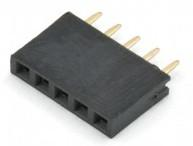

*Fig1: Pin header (1x5, 0.1inch/2.54mm pitch)*

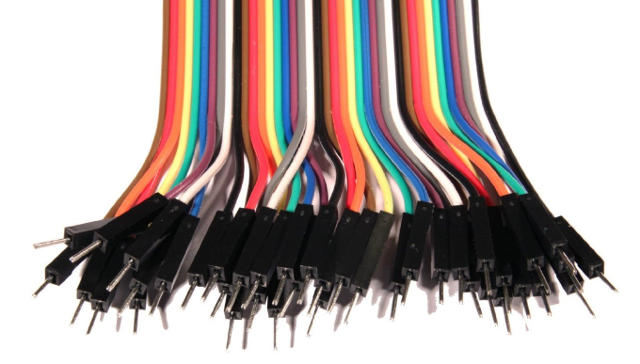

*Fig 2: Dupont wires (male)*

Start by opening the STC-1000. Cut or remove the sticker. 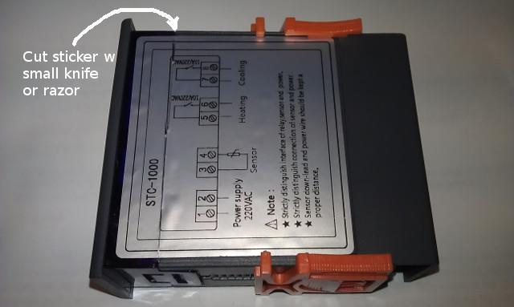

*Fig 3: Cut or remove sticker.*

Lift the tabs that hold the front panel in place and slide the board out.

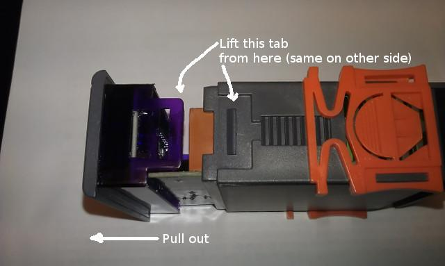

*Fig 4: Lift the tabs and pull board out.*

Check the board version (upper left corner in image) and locate the programming header.

*Fig 5: Locate programming header connections..*

It might be easier to access from the bottom of the board.

*Fig 6: Programming header can be accessed from bottom of the board as well.*

The best way to proceed is to use a vacuum solder sucker and a soldering iron to clean out the solder from the programmer header pads, exposing the holes. You might also be able to clear the holes by heating the pad from underneath with the soldering iron, then rapidly remove the iron once the solder is liquid and quickly blowing out the solder. Just take proper precautions, if trying this method.

Then the programming header can be inserted from the top of the board and soldered in place. This way you will have easy access the pins, making any future upgrades easier.

If you are not able to solder, a temporary connection for programming can be made by simply pressing the pins of the pin header against the pads by hand. The board is coated, so you may need to clean the solder pads to make the connection. 

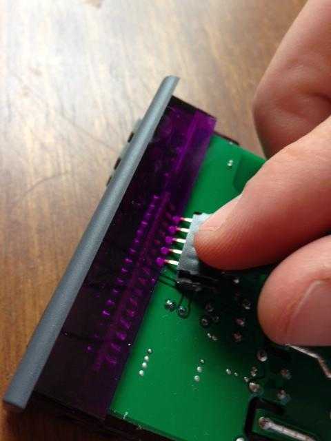

*Fig 7: Programming without soldering (image courtesy of wilconrad)*

## Performing the upload

**Before the connections are made, the sketch needs to be uploaded to the Arduino.** It is very important that connections are not made before this. An unknown program running on the Arduino could set the pins to the wrong state and short circuit the STC-1000. This could damage your STC-1000 and/or your Arduino.

First, the Arduino IDE needs to be installed, if you haven’t already. If you are not familiar with Arduino, you can read more about it at [arduino](http://arduino.cc/) or [wikipedia](http://en.wikipedia.org/wiki/Arduino).

Open *picprog.ino*, either by double-clicking the file or from *File -> Open* in the Arduino IDE. If it asks to create a folder then accept. Connect the Arduino with the USB cable and make sure the correct serial port is set under *Tools -> Serial port* and the correct board is selected under *Tools -> Board*. Then upload the sketch to the Arduino (*File -> Upload*).

Only when the sketch is uploaded correctly is it safe to make the connections to the STC-1000.

**Important:** The STC-1000 must be completely **unplugged** from mains power, but the sensor cable should be connected. During programming and testing, the STC-1000 will be powered from the Arduino.

|STC-1000|Arduino|
|--------|-------|
|ICSPCLK |D9     |
|ICSPDAT |D8     |
|GND     |GND    |
|VCC  	 |5V     |
|nMCLR	 |D3     |

*Table 1: Connections between STC-1000 and Arduino boards*

See also *Fig 5*, *Fig 6, Fig 7* and *Fig 8* for illustrations.

The connections can be made using pretty much any electrical wire, but a solid core or Dupont style wires make it a lot easier. Pin headers and Dupont wires can be found cheap on eBay and Amazon. 

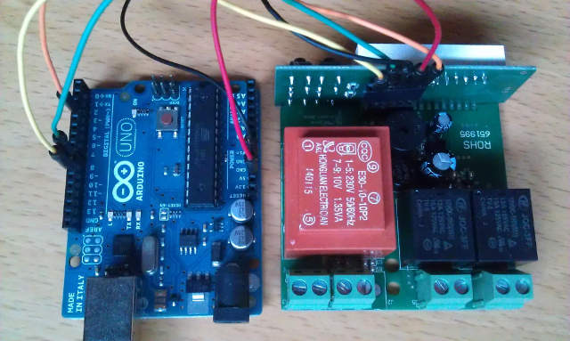

*Fig 8: Example setup (note: sensor is not connected, but it should be).*

When the sketch is uploaded and connections are made between the boards, open the serial monitor in the Arduino IDE (*Tools -> Serial Monitor*). Make sure it is set to **115200 baud** and **No line ending**. 

You should be greeted with the following output:

*STC-1000+ firmware sketch.* 
*Copyright 2014 Mats Staffansson* 
*Send 'd' to check for STC-1000* 
*Enter ‘d’ (without the apostrophes) in the serial monitor input field and press ‘Send’ button. You should then receive:* 
*Enter low voltage programming mode* 
*Leaving programming mode* 
*Device ID is: 0x27C5* 
*STC-1000 detected.* 
*No previous STC-1000+ firmware detected.* 
*Consider initializing EEPROM when flashing.* 
*Sketch has version 1.06* 
*Send 'a' to upload Celsius version and initialize EEPROM data.* 
*Send 'b' to upload Celsius version (program memory only).* 
*Send 'f' to upload Fahrenheit version and initialize EEPROM data.* 
*Send 'g' to upload Fahrenheit version (program memory only).* 

If you see this (well, version number may differ), then you are good to go. If you instead see:

*STC-1000 NOT detected. Check wiring.*

Then check your connections and try again, until you get the correct output.

Send ‘a’ or ‘f’ to upload the version you want (Celsius or Fahrenheit). If you are upgrading from a previous version of STC-1000+, you may want to use the ‘b’ or ‘g’ command instead. The difference is that all the data will be retained in EEPROM (i.e. profiles, temperature correction et.c.). When upgrading, the sketch will indicate (on the ‘d’ command output) if there are changes that might invalidate your current EEPROM data, and if so you might want to use the ‘a’/’f’ command even when upgrading, to make sure the data has sane defaults.

After sending the upload command, a lot of output will appear in the serial monitor (that might be useful, should there be a problem) and due to how the the hardware is designed, it will also make some noise during programming (this takes ~20 seconds).

## The very cheap programmer

If you are able to do some light soldering, then it is possible to build a programmer to flash the STC-1000 very cheaply using an Arduino pro mini and CP2102 (USB to TTL serial converver). Currently, this will cost around $5 on eBay. Search for "arduino pro mini 5V 16M CP2102" and you should find suitable matches. You will also need some wire. I find it easiest to use a 5 pin dupont cable. I will show how I build the programmer.

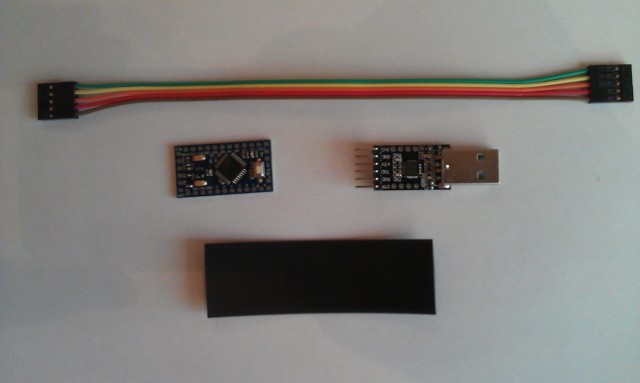

*Fig 9: The material I use, Arduino pro mini, CP2102, 5 pin dupont cable and heat shrink tubing (optional).*

First I use a flat nose plier to bend the 90 degree pin header on the CP2102 back straight.

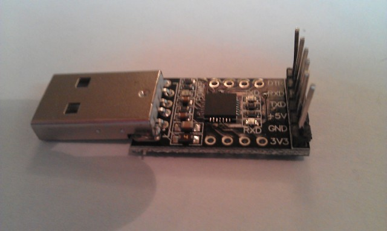

*Fig 10: CP2102 with straightened pinheader.*

The 3.3V pin needs to go. You could probably just cut it, but I heat up the solder with the soldering iron while at the same time pulling it from the other end with some pliers.

*Fig 11: Instruments of destruction, awaiting their next victim (Oh, no! Aaargh...).*

*Fig 12: -He was so young. -Yes he was, who will inform the family? Wait, that's us!.*

Ok, enough stupid captions. Flip the pro mini upside down, and the pins should line up (note: rx goes to tx and tx to rx, the others should match)

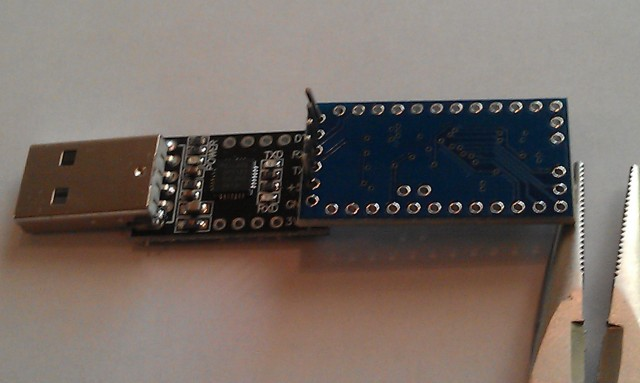

*Fig 13: Pro mini lined up on the pin header, note the empty spot for the 3.3V pin.*

Solder it in and cut the excess of the pins.

*Fig 14: CP2102 and pro mini joined together.*

Then just cut off one end of the dupont cable. Strip just a little bit of insulation off the end of each cable and pre tin. Solder each cable in the correct position (D9, D8, GND, VCC, D3). Best to feed it from below the board, as the reset button (which will still work) and other stuff is on the other side.

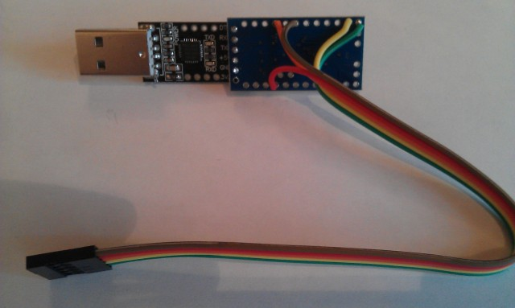

*Fig 15: This will function as a programmer.*

The last step is optional, but will make it more durable and a bit neater. Cut a few pieces off of a hot glue stick and put around and under the wires. Then feed it through an appropriately cut length of heat shrink tubing (usb connector first). 15mm diameter heat shrink tubing is a snug fit. When heating the tubing, the glue will melt and make a cheapish stress relief for the cables. A hot air gun works well to shrink the tubing, an electric hot plate (stove) also work very well. In pinch, you can even use a lighter.

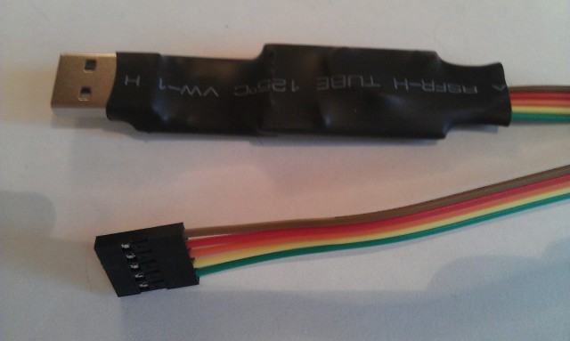

*Fig 15: Hot glue bits placed around and under the wires.*

*Fig 16: The finished 'product'.*

# Using the STC-1000+ firmware

## Features

* Both Fahrenheit and Celsius versions

* Up to 6 profiles with up to 10 setpoints.

* Each setpoint can be held for 1-999 hours (i.e. up to ~41 days).

* Oversampling and filtering of temperature

* Somewhat intuitive menus for configuring

* Separate delay settings for cooling and heating

* Configurable hysteresis (allowable temp swing)

* Optionally use a second temperature input (fridge air temp) to limit over/undershoot.

* Optionally use approximative linear ramping between setpoints

* Button acceleration, for frustrationless programming by buttons

## Navigation and menus

By default current temperature is displayed in C or F on the display, depending on which firmware is used. Pressing the 'S' button enters the menu. Pressing button 'up' and 'down' scrolls through the menu items. Button 'S' selects and 'power' button steps back or cancels current selection.

The menu is divided in two steps. When first pressing 'S', the following choices are presented:

|Menu item|Description|
|--------|-------|
|Pr0|Set parameters for profile 0|
|Pr1|Set parameters for profile 1|
|Pr2|Set parameters for profile 2|
|Pr3|Set parameters for profile 3|
|Pr4|Set parameters for profile 4|
|Pr5|Set parameters for profile 5|
|Set|Settings menu|
*Table 2: Menu items*

Selecting one of the profiles enters the submenu for that profile.

Pr0-5 submenus have the following items:

|Sub menu item|Description|Values|
|--------|-------|-------|
|SP0|Set setpoint 0|-40.0 to 140͒°C or -40.0 to 250°F|
|dh0|Set duration 0|0 to 999 hours|
|...|Set setpoint/duration x|...|
|dh8|Set duration 8|0 to 999 hours|
|SP9|Set setpoint 9|-40.0 to 140°C or -40.0 to 250°F|
*Table 3: Profile sub-menu items*

You can change all the setpoints and durations associated with that profile from here. When running the programmed profile, SP0 will be the initial setpoint, it will be held for dh0 hours (unless ramping is used). After that SP1 will be used as setpoint for dh1 hours. The profile will stop running when a duration (dh) of 0 hours OR last step is reached (consider 'dh9' implicitly 0). When the profile has ended, STC-1000+ will automatically switch to thermostat mode with the last reached setpoint. (So I guess you could also consider a 'dh' value of 0 as infinite hours).

The settings menu has the following items:

|Sub menu item|Description|Values|
|---|---|---|
|hy|Set hysteresis|0.0 to 2.5°C or 0.0 to 5.0°F|
|hy2|Set hysteresis for second temp probe|0.0 to 25.0°C or 0.0 to 50.0°F|
|tc|Set temperature correction|-2.5 to 2.5°C or -5.0 to 5.0°F|
|tc2|Set temperature correction for second temp probe|-2.5 to 2.5°C or -5.0 to 5.0°F|
|SP|Set setpoint|-40 to 140°C or -40 to 250°F|
|St|Set current profile step|0 to 8|
|dh|Set current profile duration|0 to 999 hours|
|cd|Set cooling delay|0 to 60 minutes|
|hd|Set heating delay|0 to 60 minutes|
|rP|Ramping|0 = off, 1 = on|
|Pb|Enable second temp probe for use in thermostat control|0 = off, 1 = on|
|rn|Set run mode|'Pr0' to 'Pr5' and 'th'|

*Table 4: Settings sub-menu items*

**Hysteresis**, is the allowable temperature range around the setpoint where the thermostat will not change state. For example, if temperature is greater than setpoint + hysteresis AND the time passed since last cooling cycle is greater than cooling delay, then cooling relay will be engaged. Once the temperature reaches setpoint again, cooling relay will be disengaged.

**Hysteresis 2**, is the allowable temperature range around the setpoint for temp probe 2, if it is enabled (Pb=1). For example, if temperature 2 is less than setpoint - hy2 cooling relay will cut out even if SP-hy has not been reached for temperature (1). Also, cooling will not be allowed again, until temperature 2 exceeds SP-0.5*hy2 (that is, it has regained at least half the hysteresis).

**Temperature correction**, will be added to the read temperature, this allows the user to calibrate temperature reading. It is best to calibrate around your working point. That means for fermentation, it is better to calibrate at room temperature against a reference thermometer than using ice water.

**Temperature correction 2**, same as tc but for secondary temp probe.

**Setpoint**, well... The desired temperature to keep. The way STC-1000+ firmware works, setpoint is *always* the value the thermostat strives towards, even when running a profile. What the profile does is simply setting the setpoint at given times.

**Current profile step** and **current profile duration**, allows 'jumping' in the profile. Step and duration are updated automatically when running the profile, but can also be set manually at any time. Note that profile step and profile duration are the variables directly used to keep track of progress in a profile. Little or no validation is made of what values are entered. It is up to the user to know what he/she is doing by changing these values. Changing these values will not take effect until next point in profile is calculated, which could be as much as one hour. Every hour, current duration, 'dh' (and if next step is reached, also current step, 'St') is updated with new value(s). That means in case of a power outage, STC-1000+ will pick up (to within the hour) from where it left off. Current profile step and current profile duration are only available in the menu when a profile is currently running.

**Cooling** and **heating delay** is the minimum 'off time' for each relay, to spare the compressor and relays from short cycling. If the the temperature is too high or too low, but the delay has not yet been met, the corresponding LED (heating/cooling) will blink, indicating that the controller is waiting to for the delay to pass before it will start heating or cooling. When the controller is powered on, the initial delay (for both heating and cooling) will **always** be approximately 1 minute, regardless of the settings. That is because even if your system could tolerate no heating or cooling delays during normal control (i.e. ‘cd’ and/or ‘hd’ set to zero), it would be undesirable for the relay to rapidly turn on and off in the event of a power outage causing mains power to fluctuate. Both cooling and heating delays are loaded when either cooling/heating relays switched off. So, for instance if you set cooling delay to 60 minutes and setpoint is reached, turning cooling relay off, it will be approximately one hour until cooling relay will be allowed to switch on again, even if you change your mind and change the setting in EEPROM (i.e. it will not affect the current cycle).

The delay can be used to prevent oscillation (hunting). For example, setting an appropriately long heating delay can prevent the heater coming on if the cooling cycle causes an undershoot that would otherwise cause heater to run. What is ‘appropriate’ depends on your setup.

**Run mode**, selecting 'Pr0' to 'Pr5' will start the corresponding profile running from step 0, duration 0. Selecting 'th' will switch to thermostat mode, the last setpoint from the previously running profile will be retained as the current setpoint when switching from a profile to thermostat mode.

**Thermostat mode**

When mode is set to thermostat, setpoint, ‘SP’, will not change and the controller will aim to keep the temperature to within the range of SP±hy. Much like how the normal STC-1000 firmware works.

The thermostat control runs approximately once every second.

**Running profiles**

By entering the ‘rn’ submenu under settings and selecting a profile, the current duration, ‘dh’, and current step, ‘St’, is reset to zero and the initial setpoint for that profile, ‘SP0’, is loaded into ‘SP’. Even when running a profile, ‘SP’ will always be the value the controller aims to keep. The profile simple updates ‘SP’ during its course. When a profile is running the ‘Set’ LED on the display will be lit as an indication.

From the instant the profile is started a timer will be running, and every time that timer indicates that one hour has passed, current duration, ‘dh’, will be incremented. If and only if, it has reached the current step duration, ‘dh*x*’, current duration will be reset to zero and the current step, ‘St’, will be incremented and the next setpoint in the profile will be loaded into ‘SP’.  Note that all this only happens on one hour marks after the profile is started.

So, what will happen if the profile data is updated while the profile is running? Well, if that point has not been reached the data will be used. For example profile is running step 3 (with the first step being step 0). Then ‘SP3’ has already been loaded into ‘SP’, so changing ‘SP0’ - ‘SP3’ will not have any effect on the current run. However, the duration ‘dh3’ is still being evaluated every hour against the current duration, so changing it will have effect. 

Changing the current duration, ‘dh’, and current step, ‘St’, will also have effect, but the change will not be immediate, only on the next one hour mark will these new values be used in the calculation. You will need to know what you are doing when changing these values manually, but correctly used, it could come in handy.

Changing the setpoint, ‘SP’, when running a profile, will have immediate effect (as it is used by thermostat control), but it will be overwritten by profile when it reaches a new step.

Once the profile reaches the final setpoint, ‘SP9’, or a duration of zero hours, it will switch over to thermostat mode and maintain the last known setpoint indefinitely.

Finally, to stop a running profile, simply switch to thermostat mode.

## Ramping

The essence of ramping is to interpolate between the setpoints in a profile. This allows temperature changes to occur gradually instead of in steps.

Unfortunately, due to hardware limitations, true ramping (or true interpolation), is not feasible. So instead, an approximative approach is used.

Each step is divided into (at most) 64 substeps and on each substep, setpoint is updated by linear interpolation. The substeps only occur on one hour marks, so if the duration of the step is less than 64 hours, not all substeps will be used, if the duration is greater than 64 hours, setpoint will not be updated on every one hour mark, for example if duration is 192 hours (that is 8 days), setpoint will be updated every third hour).

Note, that in order to keep a constant temperature with ramping enabled, an extra setpoint with the same value will be needed (STC-1000+ will attempt to ramp between all setpoints, but if the setpoints are the same, then the setpoint will remain constant during the step).

You can think of the ramping as being true, even if this approximation is being used, the only caveat is, if you need a long ramp (over several days or weeks) and require it to be smoother. Then you may need to split it over several steps.

Another tip would be to try to design your profiles with ramping in mind, if possible (that is include the extra setpoints when keeping constant temperature is desired), even if you will not use ramping. That way, the profiles will work as expected even if ramping is enabled.

## Secondary temperature probe input

Limit over/undershoot by putting limits on fridge air temperature. Todo, explain better what the idea is and how the hysteresis work and that swings needs be larger and more rapid than for t1.

## Additional features

**Sensor alarm**, if the measured temperature is out of range (indicating the sensor is not connected properly or broken), the internal buzzer will sound and display will show ‘AL’. If secondary probe is enabled for thermostat control (Pb=1), then alarm will go off if that temperature goes out of range as well. On alarm, both relays will be disengaged and the heating and cooling delay will be reset to 1 minute. So, once the temperature in in range again (i.e. sensor is reconnected), temperature readings can stabilize before thermostat control takes over.

**Power off**, pressing and holding power button for a few seconds when the controller is not in menu (showing current temperature), will disable the relays (soft power off) and show 'OFF' on the display. To really power off, you need to cut mains power to the device. The soft power off state will remain after a power cycle. Long pressing the power off button again will bring it out of soft power off mode.

**Switch temperature display**, pressing and releasing the power button quickly will switch which temperature probe's value is being shown on the display. If temperature from the secondary probe is showing an additional LED (between the first two digits) will be lit as an indication.

By pressing and holding ‘up’ button when temperature is showing, current setpoint will be displayed. 

By pressing and holding ‘down’ button when temperature is showing, ‘th’ will be displayed if the controller is in thermostat mode. If a profile is running, it will cycle through ‘Pr*x*’, current profile step and current profile duration, to indicate which profile is running and the progress made.

By pressing and holding ‘up’ and ‘down’ button simultaneously when temperature is showing, the firmware version number will be displayed.

# Development

STC-1000+ is written in C and compiled using [SDCC 3.3.0](http://sdcc.sourceforge.net) and [GPUTILS 1.2.0](http://gputils.sourceforge.net).

Building the HEX files are done by invoking

make all clean

## Useful tips for development

* You will need the [PIC16F1828](http://ww1.microchip.com/downloads/en/DeviceDoc/41419D.pdf) datasheet

* And to read the [SDCC Compiler user guide](http://sdcc.sourceforge.net/doc/sdccman.pdf), especially the section regarding the PIC14 port

* Initialization of static local variables does not work correctly, use global variables

* Avoid nested function calls as far as possible (limit stack usage)

* Do be very careful not to overuse memory

* Naturally, take care in not overflowing counters, do the math

* Avoid multiplication and division, especially by variable

* HEX files can be uploaded directly to STC-1000, via the sketch, over serial (without having to create and upload a new sketch with the HEX data embedded), by using the ‘u’ command (or ‘v’ for EEPROM data HEX). However, the 115200 baudrate is too fast, so delays need to be inserted. I use CuteCom in Linux and set the character delay to 2ms, just send the ‘u’ and press ‘send file’ and select the HEX. 

# Other resources

Project home at [Github](https://github.com/matsstaff/stc1000p)

Project thread on [Homebrewtalk](http://www.homebrewtalk.com/f51/stc-1000-a-464348/)

Project featured on [Hackaday](http://hackaday.com/2014/03/15/temperature-controller-gets-open-source-firmware-upgrade/)

[YouTube video](http://youtu.be/u95BEq3bk7Q) explaining the menu by Will Conrad.

[YouTube video](http://youtu.be/nZst7ETP-w8) explaining programming a profile by Will Conrad.

[Stc-1000+ Profile Builder spreadsheet](http://www.blackboxbrew.com/s/STC-1000-Profile-Builder.xlsx) by Will Conrad.

[YouTube video](http://youtu.be/oAZKI5U_SoM) showing firmware upload of STC-1000+ by Matt Hall.

# Acknowledgements

The idea of using an Arduino to program the PIC came from [here](http://forum.arduino.cc/index.php?topic=92929.0), although the code was completely rewritten.

Also, thanks to the users on Homebrewtalk that has helped testing the firmware and provided much useful feedback. Special thanks to Disney7, who have done most of the testing and Will Conrad, for his awesome videos.

Finally, a thanks to my loving wife, who (at least mostly) put up with all my beer and electronics shenanigans.

